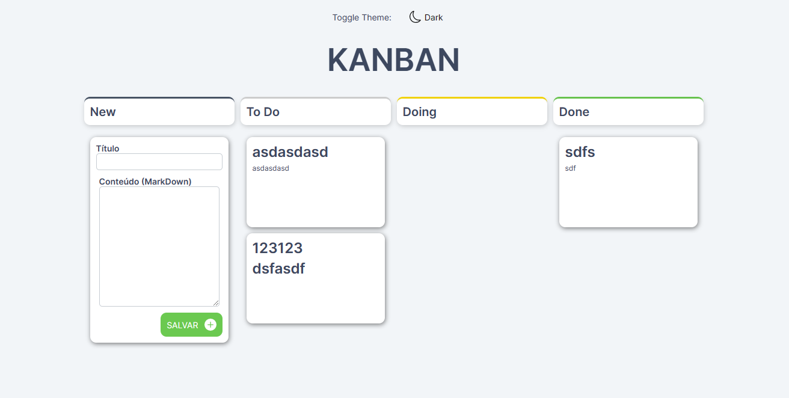
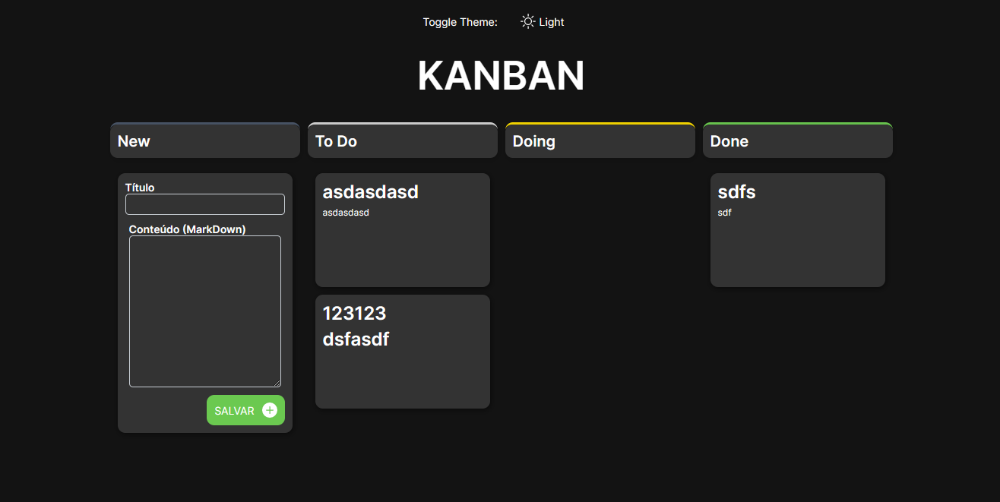

# Desafio Técnico - Frontend




## Rodando a Aplicação

1. Para rodá-la, faça:

```console
> docker-compose up --build
```

2. Espere o docker fazer a instalação das dependencias e iniciar a aplicação

3. Sua Aplicação estará pronta na porta 5173 (http://localhost:5173)

- Para iniciar storybook.

```console
> yarn storybook
```

## Desafio

Você precisa criar um frontend de acordo com os requisitos abaixo, que deve ser desenvolvido na pasta "FRONT".

Para criar seu frontend você pode escolher entre duas tecnologias:

1. Javascript ou Typescript + REACT
2. Typescript + ANGULAR

## Requisitos

- [x] 1. A API que provemos deve ser usada para persistência dos cards (ela trabalha com persistência em memória) e não deve ser alterada.

- [x] 2. A interface gráfica será apenas uma tela, nela deve haver três colunas chamadas "To do", "Doing" e "Done".

- [x] 3. Os cards deve ser listados nessas colunas de acordo com o valor do campo `lista` presente no card. Os valores de `lista` devem ser "ToDo", "Doing" e "Done", respectivamente.

- [x] 4. Deve haver um local que permita criar um card passando valores para o `titulo` e `conteudo`, deve haver um botão para adicionar o card.

- [x] 5. Um novo card deve sempre cair na lista "To Do" após persistido na API.

- [x] 6. O card deverá ter dois modos: Visualização e Edição.

- [x] 7. No modo de visualização o card terá um cabeçalho com seu título, o conteúdo e 4 botões.

- [x] 8. O `conteudo` do card pode ser markdown, utilize uma biblioteca para renderizá-lo no modo de visualização (recomendamos uma combinação de `dompurify` e `marked`). Lembre-se de estilizar o html resultante do parse do markdown... [Se quiser usar highlight para campos de código no markdown será um diferencial].

- [x] 9.  Um dos botões do card deverá excluí-lo (persistindo pela API), outro colocá-lo em modo de edição.

- [x] 10. Os dois outros botões devem mudar o card para a lista anterior (se houver) ou para a lista seguinte (se houver). A decisão de desabilitar, esconder ou apenas não gerar o evento desses botões quando não houver a proxima lista ou a anterior é sua.

- [x] 11. No modo de edição, o card conterá um input para o `titulo`, um textarea para o `conteudo` e dois botões.

- [x] 12. No modo de edição, um dos botões cancela a edição, quando precionado os campos devem ser resetados para o valor atual e voltar o card ao modo de visualização.

- [x] 13. O outro botão salva o card, persistindo as informações pela API. Também volta ao modo de visualização em seguida.

- [x] 14. Toda decisão de visual, de UI e UX é sua. Apenas utilize uma única tela.

- [x] 15. Se estiver usando REACT priorize componentes funcionais e hooks.

- [x] 16. O projeto deve ser colocado em um repositório GITHUB ou equivalente, estar público, e conter um readme.md que explique em detalhes qualquer comando ou configuração necessária para fazer o projeto rodar.

- [x] 17. A entrega será apenas a URL para clonarmos o repositório.

## Diferenciais e critérios de avaliação

- [x] Aplicação responsiva.

- [x] Adição de storybook.

- [x] Alteração para dark theme ( Todo programador ama o dark side (｡▼ 皿 ▼) )

- [x] Drag and drop nos cards _(OBS: como o backend nao esta preparado para trocar a ordem das cards, esta com um problema, ao tentar trocar, fiquei com receio de alterar o backend ser desclassificado.)_

- [x] Qualidade visual levando em conta práticas de UI e UX será considerado um diferencial. Bem como a instalação e bom uso de bibliotecas como styled-components e react-icons ou seus equivalentes para Angular se aplicável.

- [x] Arquiteturas que separem responsabilidades, de baixo acoplamento e alta-coesão são preferíveis, sobretudo usando dependências injetadas, que permitam maior facilidade para testes unitários e de integração.

- [x] Avaliaremos se o código é limpo (com boa nomenclatura de classes, variáveis, métodos e funções) e dividido em arquivos bem nomeados, de forma coesa e de acordo com boas práticas. Bem como práticas básicas como tratamento de erros.

- [ ] Desacoplar e testar os componentes e serviços com testes unitários será considerado um diferencial. _Tentei fazer alguns testes, mas sem sucesso, deixei eles mesmo sem funcionar. componente de Card_

- [x] O uso de typescript (se não for obrigatório) acompanhado das devidas configurações e tipagens bem feitas, bem como uso de técnicas de abstração usando interfaces (especialmente da lógica de persistência) serão consideradas um deferencial.

- [x] O uso de Linter será considerado um diferencial.

- [x] A criação de um docker-compose e de dockerfiles que ao rodar `docker-compose up` subam o sistema por completo (front e back) será considerado um diferencial.
